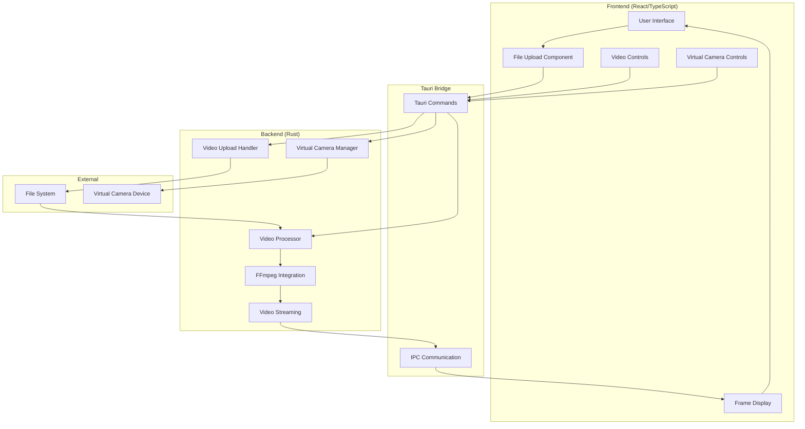
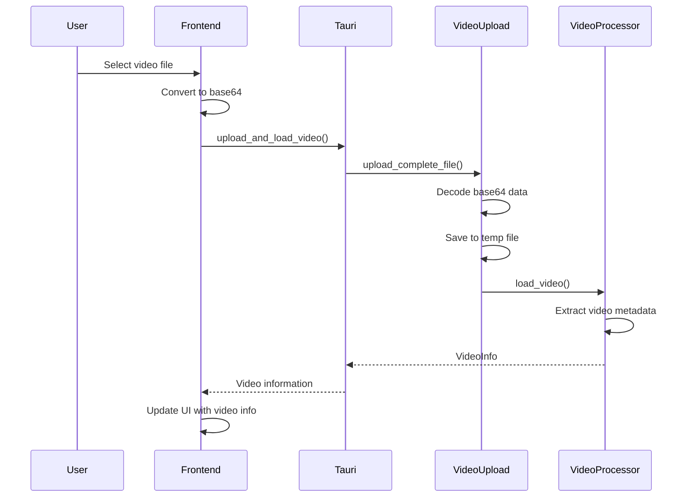
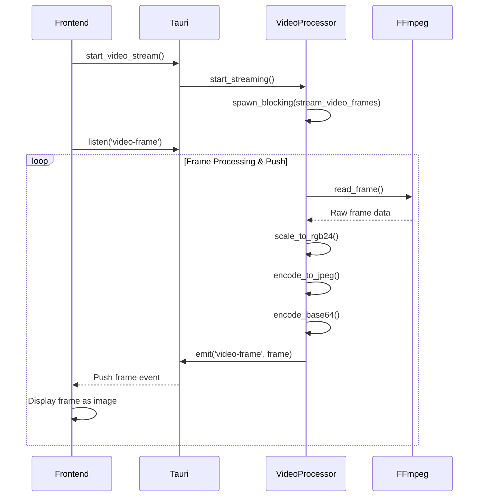
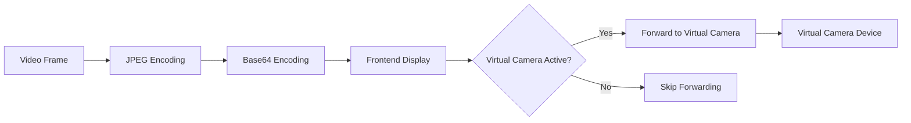

# CamLooper Code Flow Documentation

## Table of Contents
- [Overview](#overview)
- [Architecture](#architecture)
- [File Structure](#file-structure)
- [Data Flow](#data-flow)
- [Video Processing Pipeline](#video-processing-pipeline)
- [Frontend Components](#frontend-components)
- [Backend Components](#backend-components)
- [API Commands](#api-commands)
- [Performance Optimizations](#performance-optimizations)
- [Virtual Camera Integration](#virtual-camera-integration)

## Overview

CamLooper is a Tauri-based application that enables backend video processing and streaming to create a virtual camera for video conferencing applications. The application transforms uploaded videos into real-time frame streams that can be forwarded to virtual camera devices.

### Key Features
- Backend video processing using FFmpeg
- Real-time frame streaming
- Virtual camera integration
- Loop controls and playback management
- Base64-encoded video uploads
- Performance-optimized JPEG encoding

## Architecture



## File Structure

```
src-tauri/
├── src/
│   ├── lib.rs              # Main Tauri commands and application entry
│   ├── video_processor.rs  # Core video processing logic
│   ├── video_upload.rs     # File upload handling
│   └── main.rs            # Application main function
├── Cargo.toml             # Rust dependencies
└── tauri.conf.json        # Tauri configuration

src/
├── App.tsx                # Main React application
├── components/            # UI components
└── lib/                   # Utility functions
```

## Data Flow

### 1. Video Upload Flow



### 2. Video Streaming Flow (Push-Based)



## Video Processing Pipeline

### Core Processing Steps

1. **Video Loading** (`video_processor.rs:load_video()`)
   ```rust
   // Open video file with FFmpeg
   let input = ffmpeg::format::input(&file_path)?;
   
   // Find video stream
   let video_stream = input.streams().best(ffmpeg::media::Type::Video)?;
   
   // Extract metadata
   let decoder = codec_context.decoder().video()?;
   ```

2. **Frame Streaming** (`video_processor.rs:stream_video_frames_blocking()`)
   ```rust
   // Create scaler for RGB24 conversion
   let mut scaler = ffmpeg::software::scaling::context::Context::get(
       decoder.format(),
       decoder.width(),
       decoder.height(),
       ffmpeg::format::Pixel::RGB24,
       decoder.width(),
       decoder.height(),
       ffmpeg::software::scaling::Flags::FAST_BILINEAR,
   )?;
   ```

3. **Frame Encoding** (`video_processor.rs:frame_to_jpeg()`)
   ```rust
   // Convert frame to JPEG
   let mut encoder = JpegEncoder::new_with_quality(&mut cursor, 65);
   encoder.encode_image(&img)?;
   
   // Encode to base64
   let encoded = base64::prelude::BASE64_STANDARD.encode(&jpeg_data);
   ```

### Performance Optimizations

- **Fast Scaling**: Uses `FAST_BILINEAR` instead of `BILINEAR` for better performance
- **Reduced Quality**: JPEG quality set to 65 for faster encoding
- **Frame Rate Limiting**: Capped at 30 FPS maximum
- **Selective Updates**: Status updates only every 5th frame
- **Adaptive Timing**: Adjusts sleep duration based on processing time

## Frontend Components

### Main Application (`App.tsx`)

#### State Management
```typescript
const [isPlaying, setIsPlaying] = useState(false);
const [selectedVideo, setSelectedVideo] = useState<File | null>(null);
const [currentFrame, setCurrentFrame] = useState<VideoFrame | null>(null);
const [streamStatus, setStreamStatus] = useState<StreamStatus>();
```

#### Frame Receiving (Push-Based)
```typescript
const startFrameReceiving = async () => {
    // Listen for push-based video frames
    await listen<VideoFrame>('video-frame', (event) => {
        const frame = event.payload;
        setCurrentFrame(frame);
        
        // Forward to virtual camera if active
        if (isVirtualCamActive) {
            invoke('send_frame_to_virtual_camera', { frameData: frame.data });
        }
    });
};
```

#### Video Controls
```typescript
const handlePlayPause = async () => {
    if (isPlaying) {
        await invoke('pause_video_stream');
        setIsPlaying(false);
    } else {
        await invoke('start_video_stream');
        setIsPlaying(true);
        startFrameReceiving();
    }
};
```

## Backend Components

### Video Processor (`video_processor.rs`)

#### Global State Management
```rust
// Global video processor instance
static VIDEO_PROCESSOR: Lazy<Arc<Mutex<VideoProcessor>>> = 
    Lazy::new(|| Arc::new(Mutex::new(VideoProcessor::new())));

// Initialize video processor with app handle for event emission
pub async fn init_video_processor(app_handle: AppHandle) {
    let mut processor = VIDEO_PROCESSOR.lock().await;
    processor.set_app_handle(app_handle);
}
```

#### Core Structures
```rust
pub struct VideoProcessor {
    video_info: Option<VideoInfo>,
    video_path: Option<PathBuf>,
    stream_status: Arc<Mutex<StreamStatus>>,
    frame_sender: Option<mpsc::UnboundedSender<VideoFrame>>,
    is_streaming: Arc<Mutex<bool>>,
    loop_settings: Arc<Mutex<(u32, bool)>>,
}

pub struct VideoFrame {
    pub data: String, // Base64 encoded JPEG
    pub timestamp: f64,
    pub width: u32,
    pub height: u32,
}
```

### Video Upload Handler (`video_upload.rs`)

#### Upload Session Management
```rust
struct UploadSession {
    pub filename: String,
    pub temp_file: NamedTempFile,
    pub chunks_received: usize,
    pub total_chunks: usize,
    pub chunk_data: HashMap<usize, Vec<u8>>,
}
```

#### File Processing
```rust
pub fn upload_complete_file(filename: String, file_data: String) -> Result<String> {
    // Decode base64 file data
    let file_bytes = base64::prelude::BASE64_STANDARD.decode(&file_data)?;
    
    // Save to temporary file
    let mut temp_file = NamedTempFile::new()?;
    temp_file.write_all(&file_bytes)?;
    
    // Return file path for processing
    Ok(file_path)
}
```

## API Commands

### Video Operations
```rust
#[tauri::command]
async fn upload_and_load_video(filename: String, file_data: String) -> Result<VideoInfo, String>

#[tauri::command] 
async fn start_video_stream() -> Result<(), String>

#[tauri::command]
async fn pause_video_stream() -> Result<(), String>

#[tauri::command]
async fn stop_video_stream() -> Result<(), String>

#[tauri::command]
async fn get_video_stream_status() -> StreamStatus

// Note: No polling command needed - frames are pushed via events
// Backend emits 'video-frame' events that frontend listens to
```

### Virtual Camera Operations
```rust
#[tauri::command]
async fn start_virtual_camera(config: VirtualCameraConfig) -> Result<VirtualCameraStatus, String>

#[tauri::command]
async fn stop_virtual_camera() -> Result<VirtualCameraStatus, String>

#[tauri::command]
async fn send_frame_to_virtual_camera(frame_data: String) -> Result<(), String>
```

## Performance Optimizations

### Backend Optimizations

1. **Pixel Format**: Uses RGB24 instead of RGBA to reduce data processing
2. **Scaling Algorithm**: Fast bilinear scaling for better performance/quality balance
3. **JPEG Quality**: Reduced to 65 for faster encoding
4. **Frame Rate Limiting**: Capped at 30 FPS to prevent system overload
5. **Selective Processing**: Status updates and checks performed selectively
6. **Adaptive Timing**: Sleep duration adjusted based on actual processing time

### Frontend Optimizations

1. **Push-Based Streaming**: Eliminated polling entirely - frames pushed via events
2. **Status Polling**: Reduced from 100ms to 200ms intervals  
3. **Conditional Virtual Camera**: Only forwards frames when virtual camera is active
4. **Event-Driven Architecture**: Real-time frame delivery without polling overhead

### Memory Management

1. **Temporary Files**: Automatic cleanup of upload sessions
2. **Frame Buffers**: Reused FFmpeg frame objects
3. **Base64 Encoding**: Efficient streaming without accumulation

## Virtual Camera Integration

### Frame Forwarding Pipeline



### Virtual Camera Commands
```typescript
// Start virtual camera
const startVirtualCamera = async () => {
    const config = {
        width: 1920,
        height: 1080,
        fps: 30,
        camera_name: "CamLooper Virtual Camera"
    };
    await invoke('start_virtual_camera', { config });
};

// Forward frame to virtual camera
if (isVirtualCamActive) {
    await invoke('send_frame_to_virtual_camera', { 
        frameData: frame.data 
    });
}
```

## Error Handling

### Backend Error Handling
```rust
// Comprehensive error types
use anyhow::{anyhow, Result};

// Error propagation in video processing
pub async fn load_video(&mut self, file_path: PathBuf) -> Result<VideoInfo> {
    let input = ffmpeg::format::input(&file_path)
        .map_err(|e| anyhow!("Failed to open video file: {}", e))?;
    // ... processing
}
```

### Frontend Error Handling
```typescript
try {
    const frame = await invoke<VideoFrame | null>('get_next_video_frame');
    if (frame) {
        setCurrentFrame(frame);
    }
} catch (error) {
    console.error('Error receiving frame:', error);
}
```

## Threading Model

### Backend Threading
- **Main Thread**: Handles Tauri commands and UI communication
- **Blocking Thread**: Processes video frames using `tokio::task::spawn_blocking`
- **Frame Channel**: Unbounded MPSC channel for frame distribution

### Thread Safety
- **Mutex Guards**: Protect shared state with `Arc<Mutex<T>>`
- **Blocking Locks**: Use `blocking_lock()` in video processing thread
- **Send/Sync**: All shared types implement required traits

## Development Workflow

### Building and Running
```bash
# Install dependencies
npm install

# Development mode
npm run tauri dev

# Production build
npm run tauri build
```

### Testing Video Processing
1. Start development server
2. Upload a video file through the UI
3. Use play controls to test streaming
4. Monitor performance in browser developer tools
5. Test virtual camera integration with video conferencing apps

This documentation provides a comprehensive overview of the CamLooper codebase, from high-level architecture to specific implementation details. The modular design enables easy maintenance and feature additions while maintaining optimal performance for real-time video processing. 