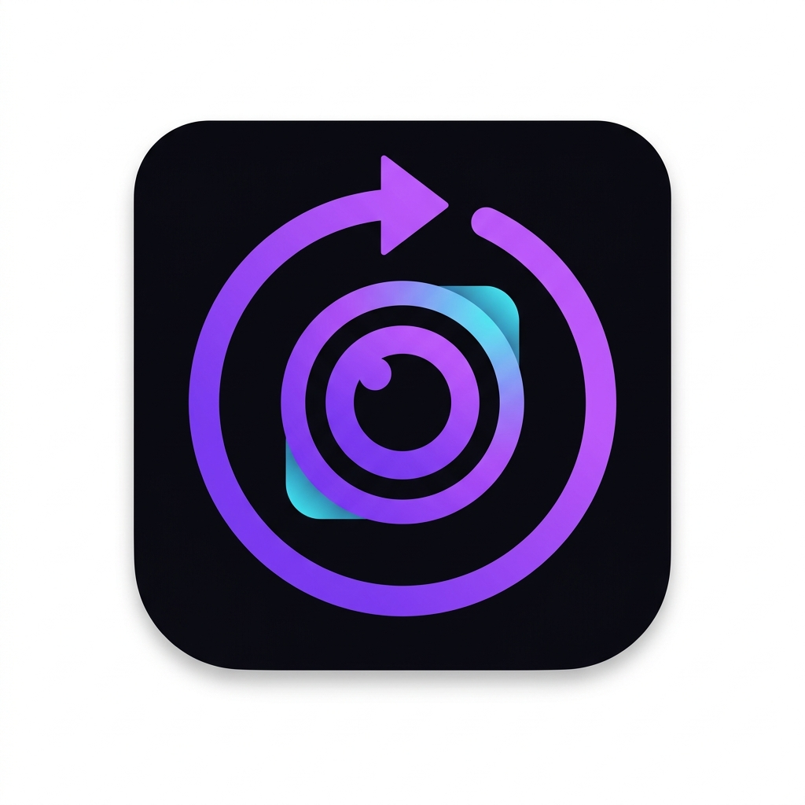

# CamLooper

<div align="center">
  
  
  **Transform any video recording into a seamless virtual camera**
  
  [](LICENSE)
  [](https://github.com/amitmtrn/camlooper-app/releases)
  [](https://github.com/amitmtrn/camlooper-app/releases)
  
  [Download](https://camlooper.com/download) • [Documentation](docs/) • [Report Bug](https://github.com/amitmtrn/camlooper-app/issues) • [Feature Request](https://github.com/amitmtrn/camlooper-app/issues)
</div>

## 🎥 What is CamLooper?

CamLooper is a powerful desktop application that transforms any video recording into a virtual camera that works seamlessly with video conferencing applications, streaming software, and any application that supports camera input. Perfect for content creators, streamers, educators, and professionals who want to use pre-recorded content in their video calls or streams.

### ✨ Key Features

- 🎬 **Universal Virtual Camera** - Works with Zoom, Teams, OBS, Discord, and virtually any application
- 🔄 **Seamless Video Looping** - Perfect smooth transitions with customizable loop settings
- ⚡ **High Performance** - Optimized FFmpeg processing with minimal system impact
- 🔒 **Privacy First** - All processing happens locally - your videos never leave your device
- 💰 **Completely Free** - No subscriptions, no hidden fees, supported by unobtrusive ads
- 🌐 **Cross-Platform** - Native support for Windows, macOS, and Linux
- 📱 **Modern UI** - Beautiful, intuitive interface built with modern web technologies
- 📖 **Source Available** - Read, build and modify the code for any noncommercial purpose

## 🚀 Quick Start

1. **Download** CamLooper from [camlooper.com/download](https://camlooper.com/download) or the [releases page](https://github.com/amitmtrn/camlooper-app/releases)
2. **Install** the application on your system
3. **Upload** your video file using drag-and-drop
4. **Configure** loop settings and quality options
5. **Activate** the virtual camera
6. **Select** "CamLooper Virtual Camera" in your video conferencing app

## 📥 Installation

### System Requirements

**Minimum:**
- Windows 10/11, macOS 10.15+, or Linux (Ubuntu 18.04+)
- 4GB RAM
- 100MB free disk space
- Intel Core i3 or AMD equivalent

**Recommended:**
- 8GB RAM
- Dedicated graphics card
- Intel Core i5 or AMD Ryzen 5

### Download & Install

Grab the installer for your platform from the
[releases page](https://github.com/amitmtrn/camlooper-app/releases).

> ⚠️ **Unsigned builds:** the published installers are not yet code-signed. Windows
> SmartScreen and macOS Gatekeeper will warn on first launch — this is expected. On
> **macOS the virtual-camera System Extension will not load until the app is signed and
> notarized** with an Apple Developer certificate (see [Building & Releasing](#-building--releasing));
> until then the app runs but the virtual camera won't register on macOS.

#### Windows
1. Download the `.exe` (NSIS) or `.msi` installer.
2. Run it as administrator (SmartScreen → *More info* → *Run anyway*).
3. Virtual camera drivers are installed automatically.

#### macOS
1. Download the `.dmg` matching your chip — **Apple Silicon** (`aarch64`) or **Intel** (`x86_64`).
2. Open the DMG and drag CamLooper to Applications.
3. First launch: right-click → *Open* to bypass Gatekeeper, then grant camera permission.

#### Linux
**For the working virtual camera, use the `.deb`/`.rpm`** (not the AppImage). They pull in
`v4l2loopback-dkms` + `ffmpeg`, install the module config, and **auto-load `v4l2loopback`**
(on install and every boot) so the "CamLooper Virtual Camera" device is ready with no manual
setup:
```bash
sudo apt install ./camlooper_*.deb     # Debian/Ubuntu
sudo dnf install ./camlooper-*.rpm      # Fedora/RHEL
```

The **AppImage** is portable but cannot install a kernel module, so the virtual camera only
works if the host already has `v4l2loopback` loaded:
```bash
wget https://github.com/amitmtrn/camlooper-app/releases/latest/download/camlooper_x86_64.AppImage
chmod +x camlooper_*.AppImage
./camlooper_*.AppImage
# one-time host setup for the AppImage:
sudo apt install v4l2loopback-dkms && sudo modprobe v4l2loopback
```

### 🏗 Building & Releasing

Because of native dependencies (FFmpeg, the Windows DirectShow filter, the macOS System
Extension), the app **cannot be cross-compiled** — each OS builds on its own machine.
CI does this for you: pushing a `v*` tag runs
[`.github/workflows/build-cross-platform.yml`](.github/workflows/build-cross-platform.yml),
which builds Windows, macOS (Apple Silicon) and Linux on native runners via
[`tauri-action`](https://github.com/tauri-apps/tauri-action) and attaches all installers to a
**published GitHub Release**. Pull requests run a fast typecheck/lint/build check plus a
Linux build; the Windows and macOS legs only run on tags and manual dispatch.

```bash
git tag v0.2.2
git push origin v0.2.2     # -> Release with .exe/.msi, .dmg, .AppImage/.deb/.rpm
```

**Code signing is currently disabled**, so CI produces unsigned installers. The workflow
does *not* pass the signing env vars, because Tauri treats an empty `APPLE_CERTIFICATE` as
"sign with this certificate" and fails the build. To enable signing, add the repository
*Secrets* first (`APPLE_CERTIFICATE`, `APPLE_CERTIFICATE_PASSWORD`, `APPLE_SIGNING_IDENTITY`,
`APPLE_ID`, `APPLE_PASSWORD`, `APPLE_TEAM_ID` for macOS; `WINDOWS_CERTIFICATE`,
`WINDOWS_CERTIFICATE_PASSWORD` for Windows), then uncomment the corresponding lines in
[`build-cross-platform.yml`](.github/workflows/build-cross-platform.yml).

To build locally for **your current OS only**: `npm ci` then `npm run build:linux` /
`npm run build:macos` (or `build:macos:intel`) / `npm run build:windows:msvc`.
Windows builds additionally need `npm run fetch:win-ffmpeg` first — it downloads the FFmpeg
DLLs that the installer bundles, which are not committed to the repo.

## 🎯 Use Cases

### Professional Video Calls
- Create professional backgrounds for work meetings
- Use pre-recorded presentations in calls
- Maintain consistent branding across meetings

### Content Creation & Streaming
- Loop intro/outro videos in live streams
- Use pre-recorded content with OBS Studio
- Create consistent visual elements for content

### Education & Training
- Use educational videos as visual aids in online classes
- Loop demonstration videos during presentations
- Provide consistent video content for training sessions

### Software Development
- Test applications with consistent video input
- Create reproducible test scenarios
- Demonstrate software with controlled video content

## 🖥️ Platform Support

| Platform | Virtual camera backend | State |
|---|---|---|
| **Linux** | `v4l2loopback` (auto-loaded by the `.deb`/`.rpm`) + system FFmpeg | Working |
| **Windows** | [softcam](https://github.com/tshino/softcam) DirectShow filter + bundled FFmpeg | Working; also distributed via the Microsoft Store |
| **macOS** | CMIO Camera Extension | **Scaffolded only** — the app runs, but the camera does not register until the build is signed and notarized with an Apple Developer certificate |

Platform-specific notes live in
[Windows implementation](docs/WINDOWS_VIRTUAL_CAMERA_IMPLEMENTATION.md),
[Windows troubleshooting](docs/WINDOWS_TROUBLESHOOTING.md) and
[Troubleshooting](docs/TROUBLESHOOTING.md).

## 🛠 Technology Stack

CamLooper is built with modern, high-performance technologies:

- **Frontend**: React 18, TypeScript, Tailwind CSS, shadcn/ui
- **Backend**: Rust, Tauri, FFmpeg
- **Build System**: Vite, Cargo
- **Cross-Platform**: Native Windows, macOS, and Linux support

## 📚 Documentation

Comprehensive documentation is available in the [`docs/`](docs/) directory:

- **[User Guide](docs/USER_GUIDE.md)** - Complete user manual with step-by-step instructions
- **[API Documentation](docs/API.md)** - Complete API reference for developers
- **[Architecture](docs/ARCHITECTURE.md)** - Technical architecture and system design
- **[Development Guide](docs/DEVELOPMENT.md)** - Setup and development workflow
- **[Troubleshooting](docs/TROUBLESHOOTING.md)** - Common issues and solutions
- **[Contributing](docs/CONTRIBUTING.md)** - How to contribute to the project

## 🔧 Development

### Prerequisites
- Node.js 20+ with npm
- Rust stable with Cargo
- **FFmpeg 8** development libraries — the `ffmpeg-next 8.0` crate needs FFmpeg 8 headers, so
  distributions still on FFmpeg 4/6 (Ubuntu 22.04, Debian 12) will fail to compile

On Debian/Ubuntu, the same packages CI installs:
```bash
sudo apt-get install -y libwebkit2gtk-4.1-dev libappindicator3-dev librsvg2-dev patchelf \
  pkg-config libavcodec-dev libavformat-dev libavutil-dev libavdevice-dev libavfilter-dev \
  libswscale-dev libswresample-dev ffmpeg libclang-dev
```
`libclang-dev` is required (the FFmpeg bindings generate bindings at build time) and
`librsvg2-dev` is required for AppImage bundling — without it `tauri build` fails at
"failed to run linuxdeploy" after the `.deb` and `.rpm` are already produced.

### Setup
```bash
# Clone the repository
git clone https://github.com/amitmtrn/camlooper-app.git
cd camlooper-app

# Install dependencies (npm ci respects the lockfile; use npm, not bun)
npm ci

# Start development server
npm run tauri:dev
```

### Building
```bash
# Build for production (produces .deb, .rpm and .AppImage on Linux)
npm run tauri:build

# Checks that CI runs on every PR
npm run typecheck
npm run lint
npm run build
```
See [docs/CROSS_COMPILATION_GUIDE.md](docs/CROSS_COMPILATION_GUIDE.md) for the
platform-specific build scripts.

For detailed development instructions, see our [Development Guide](docs/DEVELOPMENT.md).

## 🤝 Contributing

We welcome contributions from the community! Whether you're fixing bugs, adding features, improving documentation, or helping other users, your contributions make CamLooper better for everyone.

### Ways to Contribute
- 🐛 Report bugs and issues
- 💡 Suggest new features
- 🔧 Submit pull requests
- 📖 Improve documentation
- 💬 Help other users in discussions

Please read our [Contributing Guide](docs/CONTRIBUTING.md) before you start. Two things to
know up front: contributions are accepted under the project's noncommercial license, and
commits must be signed off (`git commit -s`) to certify you have the right to submit them.
Security issues go to [SECURITY.md](SECURITY.md), not the issue tracker.

## 📄 License

CamLooper is **source-available, not open source**. It is licensed under
[PolyForm Noncommercial 1.0.0](LICENSE): you may read, build, modify and share it for any
**noncommercial** purpose — personal projects, study, research, teaching, hobby work — but
commercial use requires a separate license.

**Why not MIT?** CamLooper is a product that funds its own development. Publishing the source
lets people learn from it, audit what a virtual camera driver does on their machine, and fix
things; it is not an invitation to repackage and sell it. If you want to use CamLooper
commercially, that is a conversation, not a dead end — email amit7000@gmail.com.

Related documents:
- [LICENSE](LICENSE) — the full terms
- [THIRD-PARTY.md](THIRD-PARTY.md) — bundled components (softcam, FFmpeg) under their own licenses
- [TRADEMARK.md](TRADEMARK.md) — the name and logo are not covered by the license; forks must rebrand

## 💰 How this is funded

The app shows a small ad banner at the top of its window, loaded in an iframe from
`camlooper.com/ads/banner` (see `src/lib/ads.ts` and `src/components/AdBanner.tsx`). It is
the only network request CamLooper makes by default, it is dismissible for the session, and
no video ever leaves your machine. It is in the public source deliberately: what you build
from this repository behaves the same as the installers we ship.

## 🙏 Acknowledgments

CamLooper is built on top of amazing open-source technologies:

- [Tauri](https://tauri.app/) - For the cross-platform application framework
- [FFmpeg](https://ffmpeg.org/) - For video processing capabilities
- [React](https://reactjs.org/) - For the user interface
- [Rust](https://www.rust-lang.org/) - For high-performance backend processing

## 📞 Support

### Getting Help
- 📖 **Documentation**: Start with our comprehensive [documentation](docs/)
- 🐛 **Issues**: Report bugs on [GitHub Issues](https://github.com/amitmtrn/camlooper-app/issues)
- 💬 **Discussions**: Ask questions in [GitHub Discussions](https://github.com/amitmtrn/camlooper-app/discussions)
- 🔧 **Troubleshooting**: Check our [troubleshooting guide](docs/TROUBLESHOOTING.md)

### Community
Join our growing community of content creators, developers, and enthusiasts:
- Share your use cases and creative applications
- Help other users with questions and issues
- Contribute to the project's development
- Suggest new features and improvements

---

<div align="center">
  <p>Made with ❤️ by the CamLooper community</p>
  <p>
    <a href="https://github.com/amitmtrn/camlooper-app/stargazers">⭐ Star us on GitHub</a> •
    <a href="https://github.com/amitmtrn/camlooper-app/releases">📥 Download Latest</a> •
    <a href="docs/">📚 Read Docs</a>
  </p>
</div>
