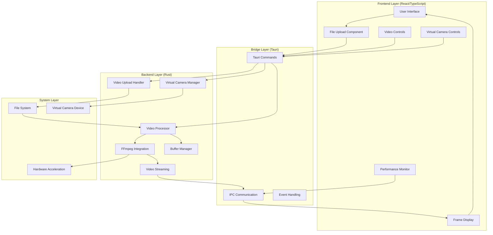
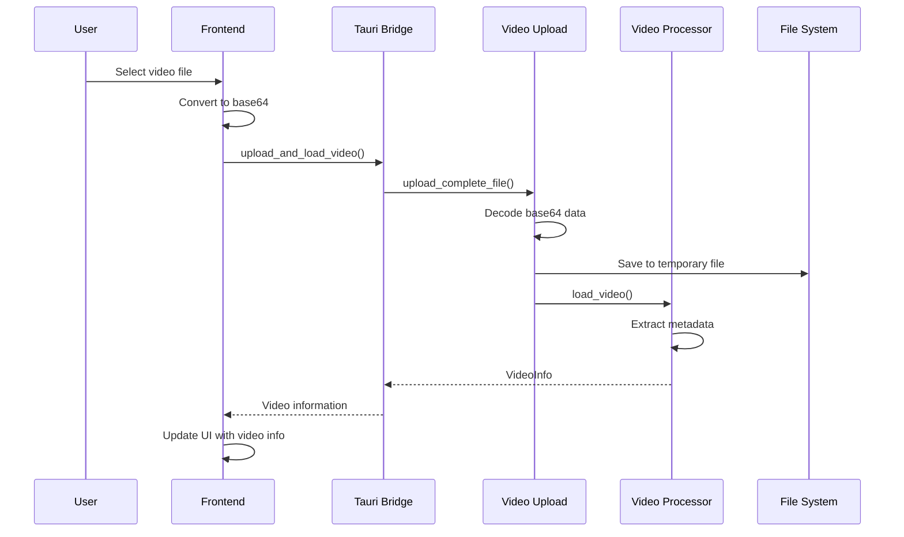
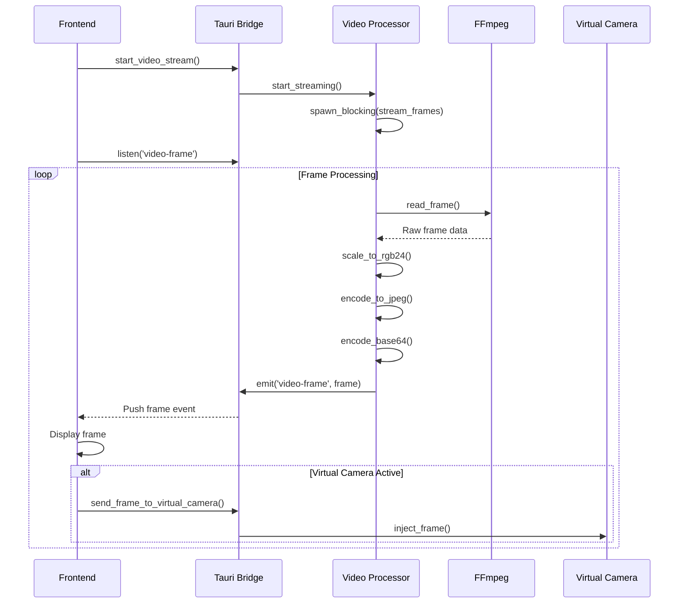

# CamLooper Architecture Documentation

## Table of Contents
- [Overview](#overview)
- [System Architecture](#system-architecture)
- [Technology Stack](#technology-stack)
- [Core Components](#core-components)
- [Data Flow](#data-flow)
- [Video Processing Pipeline](#video-processing-pipeline)
- [Performance Optimizations](#performance-optimizations)
- [Threading Model](#threading-model)
- [Error Handling](#error-handling)
- [Security Considerations](#security-considerations)

## Overview

CamLooper is built using a modern, cross-platform architecture that combines the performance of native Rust backends with the flexibility of web-based frontends. The application uses Tauri as the bridge between a React/TypeScript frontend and a high-performance Rust backend for video processing.

## System Architecture



## Technology Stack

### Frontend Technologies
- **React 18**: Modern UI framework with hooks and concurrent features
- **TypeScript**: Type-safe JavaScript for better development experience
- **Tailwind CSS**: Utility-first CSS framework for responsive design
- **shadcn/ui**: Modern component library built on Radix UI
- **Vite**: Fast build tool and development server

### Backend Technologies
- **Rust**: High-performance systems programming language
- **Tauri**: Cross-platform desktop app framework
- **FFmpeg**: Industry-standard video processing library
- **Tokio**: Asynchronous runtime for Rust
- **Serde**: Serialization/deserialization framework

### Platform-Specific Components
- **Windows**: DirectShow and MediaFoundation APIs
- **macOS**: Core Foundation and Core Graphics
- **Linux**: V4L2 (Video4Linux2) for virtual camera support

## Core Components

### Frontend Components

#### Main Application (`App.tsx`)
The primary React component that orchestrates the entire user interface and manages application state.

**Key Responsibilities:**
- State management for video playback, virtual camera, and UI
- Event handling for user interactions
- Real-time frame rendering and display
- Performance metrics monitoring

**State Management:**
```typescript
interface AppState {
  isPlaying: boolean;
  isVirtualCamActive: boolean;
  selectedVideo: File | null;
  videoInfo: VideoInfo | null;
  currentFrame: VideoFrame | null;
  streamStatus: StreamStatus;
  performanceMetrics: PerformanceMetrics;
}
```

#### Frame Buffer (`FrontendFrameBuffer`)
Client-side buffering system for smooth video playback.

**Features:**
- Configurable buffer size (default: 10 frames)
- Thread-safe frame management
- Automatic buffer health monitoring
- Frame dropping for performance optimization

### Backend Components

#### Video Processor (`video_processor.rs`)
Core component responsible for video processing and frame streaming.

**Key Features:**
- FFmpeg integration for video decoding
- Real-time frame processing and encoding
- Performance-optimized scaling and format conversion
- Automatic loop management
- Push-based frame delivery

**Core Structure:**
```rust
pub struct VideoProcessor {
    video_info: Option<VideoInfo>,
    video_path: Option<PathBuf>,
    stream_status: Arc<Mutex<StreamStatus>>,
    frame_sender: Option<mpsc::UnboundedSender<VideoFrame>>,
    is_streaming: Arc<Mutex<bool>>,
    loop_settings: Arc<Mutex<(u32, bool)>>,
    app_handle: Option<AppHandle>,
}
```

#### Video Upload Handler (`video_upload.rs`)
Manages file uploads with support for both streaming and complete file uploads.

**Upload Methods:**
- **Streaming Upload**: Chunked upload for large files
- **Complete Upload**: Base64-encoded single transfer
- **Session Management**: Temporary file handling and cleanup

#### Virtual Camera Manager (`virtual_camera.rs`)
Platform-specific virtual camera implementation.

**Capabilities:**
- Cross-platform virtual camera creation
- Frame injection into virtual camera devices
- Camera configuration and status management
- Device enumeration and selection

## Data Flow

### Video Upload Flow



### Video Streaming Flow



## Video Processing Pipeline

### Frame Processing Steps

1. **Video Decoding**
   ```rust
   // Open video file with FFmpeg
   let input = ffmpeg::format::input(&file_path)?;
   let video_stream = input.streams().best(ffmpeg::media::Type::Video)?;
   let mut decoder = codec_context.decoder().video()?;
   ```

2. **Frame Scaling**
   ```rust
   // Create scaler for RGB24 conversion
   let mut scaler = ffmpeg::software::scaling::context::Context::get(
       decoder.format(), decoder.width(), decoder.height(),
       ffmpeg::format::Pixel::RGB24, decoder.width(), decoder.height(),
       ffmpeg::software::scaling::Flags::FAST_BILINEAR,
   )?;
   ```

3. **Frame Encoding**
   ```rust
   // Convert frame to JPEG
   let mut encoder = JpegEncoder::new_with_quality(&mut cursor, 65);
   encoder.encode_image(&img)?;
   
   // Encode to base64 for transport
   let encoded = base64::prelude::BASE64_STANDARD.encode(&jpeg_data);
   ```

### Performance Characteristics
- **Frame Rate**: Capped at 30 FPS maximum
- **JPEG Quality**: Set to 65 for optimal size/quality balance
- **Pixel Format**: RGB24 for reduced memory usage
- **Scaling Algorithm**: Fast bilinear for performance

## Performance Optimizations

### Backend Optimizations

1. **Efficient Pixel Formats**
   - Uses RGB24 instead of RGBA (25% memory reduction)
   - Fast bilinear scaling algorithm
   - Hardware acceleration when available

2. **Adaptive Quality Control**
   - Dynamic JPEG quality adjustment based on performance
   - Frame dropping during high load
   - Intelligent buffer management

3. **Memory Management**
   - Frame buffer reuse
   - Automatic temporary file cleanup
   - Efficient base64 encoding

### Frontend Optimizations

1. **Push-Based Architecture**
   - Eliminates polling overhead
   - Real-time frame delivery
   - Event-driven updates

2. **Selective Rendering**
   - Conditional virtual camera forwarding
   - Performance metrics on demand
   - Optimized React rendering

3. **Buffer Management**
   - Configurable frame buffering
   - Automatic buffer health monitoring
   - Frame interpolation for smooth playback

## Threading Model

### Backend Threading Architecture

```rust
// Main thread: Tauri commands and UI communication
async fn start_video_stream() -> Result<(), String>

// Blocking thread: Video processing
tokio::task::spawn_blocking(move || {
    stream_video_frames_blocking(processor, app_handle)
})

// Channel communication: Frame distribution
let (frame_sender, frame_receiver) = mpsc::unbounded_channel();
```

### Thread Safety
- **Mutex Guards**: Protect shared state with `Arc<Mutex<T>>`
- **Blocking Operations**: Use `blocking_lock()` in video processing thread
- **Send/Sync Traits**: All shared types implement required traits
- **Channel Communication**: Unbounded MPSC channels for frame distribution

## Error Handling

### Comprehensive Error Management

```rust
// Custom error types
use anyhow::{anyhow, Result};

// Error propagation
pub async fn load_video(&mut self, file_path: PathBuf) -> Result<VideoInfo> {
    let input = ffmpeg::format::input(&file_path)
        .map_err(|e| anyhow!("Failed to open video file: {}", e))?;
    // ... processing
}
```

### Error Categories
- **File System Errors**: Invalid paths, permissions, disk space
- **Video Processing Errors**: Codec issues, format incompatibility
- **Virtual Camera Errors**: Device conflicts, driver issues
- **Performance Errors**: Memory exhaustion, frame dropping

## Security Considerations

### Data Privacy
- **Local Processing**: All video processing happens on the user's device
- **No Network Transfer**: Videos never leave the local system
- **Temporary File Security**: Secure temporary file handling with automatic cleanup
- **Memory Protection**: Sensitive data cleared from memory after use

### System Security
- **Sandboxed Environment**: Tauri provides security isolation
- **Permission Model**: Minimal required system permissions
- **File System Access**: Restricted to user-selected files
- **Virtual Camera Isolation**: Camera streams confined to local system

### Input Validation
- **File Type Validation**: Strict video format checking
- **Size Limits**: Reasonable file size restrictions
- **Content Sanitization**: Safe handling of user-provided data
- **API Parameter Validation**: All Tauri commands validate inputs

---

This architecture enables CamLooper to deliver high-performance video processing while maintaining security, privacy, and cross-platform compatibility. The modular design allows for easy maintenance and feature additions while ensuring optimal performance for real-time video streaming. 